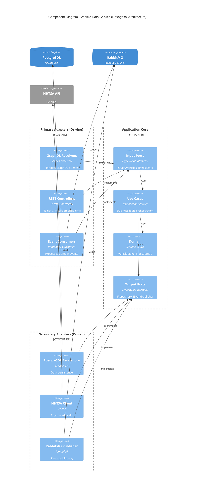

# Component Diagram

## Hexagonal Architecture Layers

### Primary Adapters (Driving)

Components that drive the application:

- **GraphQL Resolvers**: Handle incoming GraphQL queries/mutations
- **REST Controllers**: Handle HTTP requests for health and admin
- **Event Consumers**: Process events from message queue

### Application Core

The heart of the application:

- **Input Ports**: Interfaces defining how to drive the application
- **Use Cases**: Application services orchestrating business logic
- **Domain**: Entities, value objects, and domain events
- **Output Ports**: Interfaces for external dependencies

### Secondary Adapters (Driven)

Components driven by the application:

- **PostgreSQL Repository**: Persists domain entities
- **NHTSA Client**: Fetches external vehicle data
- **RabbitMQ Publisher**: Publishes domain events
