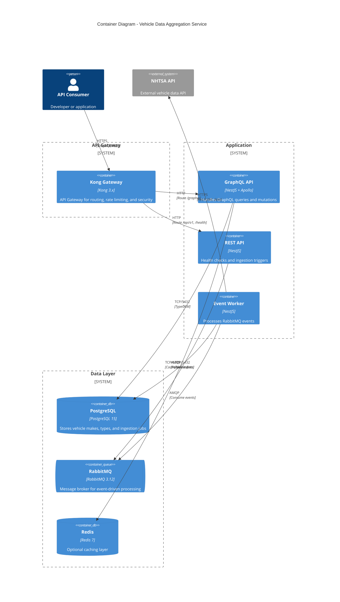

# Container Diagram

## Container Descriptions

| Container    | Technology      | Purpose                                           |
| ------------ | --------------- | ------------------------------------------------- |
| Kong Gateway | Kong 3.x        | API gateway handling routing, rate limiting, CORS |
| GraphQL API  | NestJS + Apollo | Serves vehicle data through GraphQL queries       |
| REST API     | NestJS          | Health endpoints and ingestion management         |
| Event Worker | NestJS          | Processes ingestion events asynchronously         |
| PostgreSQL   | PostgreSQL 15   | Primary data store                                |
| RabbitMQ     | RabbitMQ 3.12   | Event bus for async processing                    |
| Redis        | Redis 7         | Optional query caching                            |
