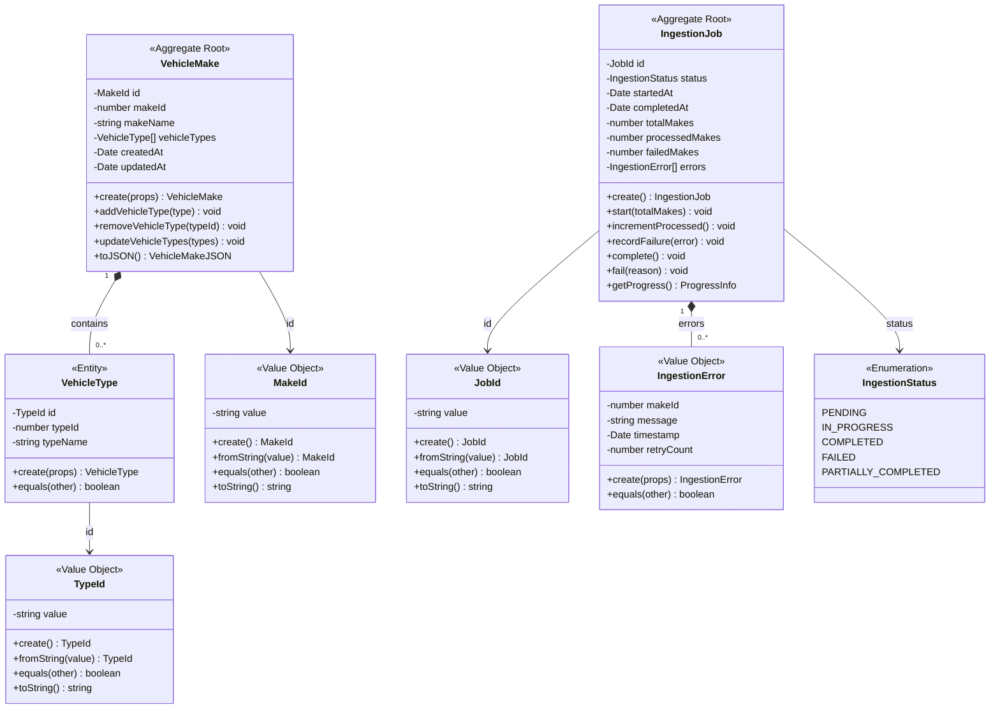
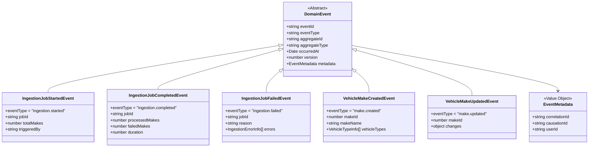
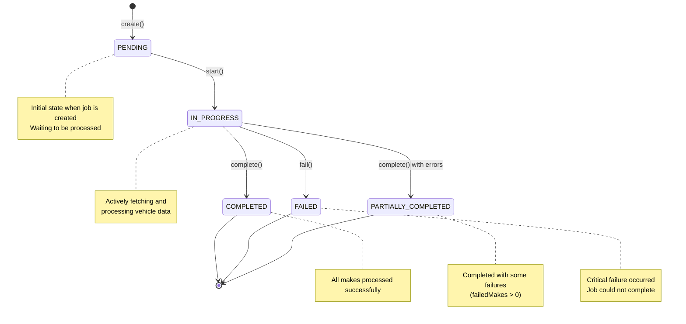
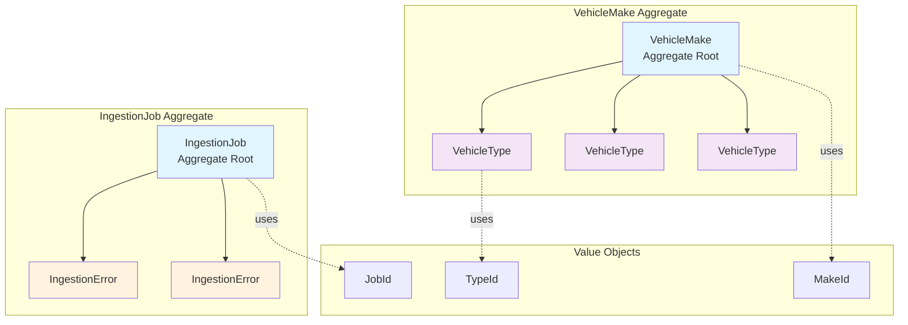
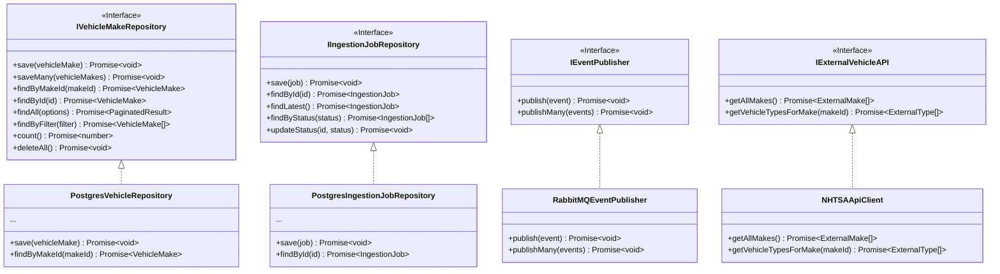

# Domain Model Diagrams

## 1. Domain Entities Class Diagram

```mermaid
classDiagram
    class VehicleMake {
        <<Aggregate Root>>
        -MakeId id
        -number makeId
        -string makeName
        -VehicleType[] vehicleTypes
        -Date createdAt
        -Date updatedAt
        +create(props) VehicleMake
        +addVehicleType(type) void
        +removeVehicleType(typeId) void
        +updateVehicleTypes(types) void
        +toJSON() VehicleMakeJSON
    }

    class VehicleType {
        <<Entity>>
        -TypeId id
        -number typeId
        -string typeName
        +create(props) VehicleType
        +equals(other) boolean
    }

    class IngestionJob {
        <<Aggregate Root>>
        -JobId id
        -IngestionStatus status
        -Date startedAt
        -Date completedAt
        -number totalMakes
        -number processedMakes
        -number failedMakes
        -IngestionError[] errors
        +create() IngestionJob
        +start(totalMakes) void
        +incrementProcessed() void
        +recordFailure(error) void
        +complete() void
        +fail(reason) void
        +getProgress() ProgressInfo
    }

    class MakeId {
        <<Value Object>>
        -string value
        +create() MakeId
        +fromString(value) MakeId
        +equals(other) boolean
        +toString() string
    }

    class TypeId {
        <<Value Object>>
        -string value
        +create() TypeId
        +fromString(value) TypeId
        +equals(other) boolean
        +toString() string
    }

    class JobId {
        <<Value Object>>
        -string value
        +create() JobId
        +fromString(value) JobId
        +equals(other) boolean
        +toString() string
    }

    class IngestionError {
        <<Value Object>>
        -number makeId
        -string message
        -Date timestamp
        -number retryCount
        +create(props) IngestionError
        +equals(other) boolean
    }

    class IngestionStatus {
        <<Enumeration>>
        PENDING
        IN_PROGRESS
        COMPLETED
        FAILED
        PARTIALLY_COMPLETED
    }

    VehicleMake "1" *-- "0..*" VehicleType : contains
    VehicleMake --> MakeId : id
    VehicleType --> TypeId : id
    IngestionJob --> JobId : id
    IngestionJob --> IngestionStatus : status
    IngestionJob "1" *-- "0..*" IngestionError : errors
```

## 2. Domain Events

```mermaid
classDiagram
    class DomainEvent {
        <<Abstract>>
        +string eventId
        +string eventType
        +string aggregateId
        +string aggregateType
        +Date occurredAt
        +number version
        +EventMetadata metadata
    }

    class EventMetadata {
        <<Value Object>>
        +string correlationId
        +string causationId
        +string userId
    }

    class IngestionJobStartedEvent {
        +eventType = "ingestion.started"
        +string jobId
        +number totalMakes
        +string triggeredBy
    }

    class IngestionJobCompletedEvent {
        +eventType = "ingestion.completed"
        +string jobId
        +number processedMakes
        +number failedMakes
        +number duration
    }

    class IngestionJobFailedEvent {
        +eventType = "ingestion.failed"
        +string jobId
        +string reason
        +IngestionErrorInfo[] errors
    }

    class VehicleMakeCreatedEvent {
        +eventType = "make.created"
        +number makeId
        +string makeName
        +VehicleTypeInfo[] vehicleTypes
    }

    class VehicleMakeUpdatedEvent {
        +eventType = "make.updated"
        +number makeId
        +object changes
    }

    DomainEvent <|-- IngestionJobStartedEvent
    DomainEvent <|-- IngestionJobCompletedEvent
    DomainEvent <|-- IngestionJobFailedEvent
    DomainEvent <|-- VehicleMakeCreatedEvent
    DomainEvent <|-- VehicleMakeUpdatedEvent
    DomainEvent --> EventMetadata
```

## 3. State Machine - Ingestion Job

```mermaid
stateDiagram-v2
    [*] --> PENDING: create()

    PENDING --> IN_PROGRESS: start()

    IN_PROGRESS --> COMPLETED: complete()
    IN_PROGRESS --> FAILED: fail()
    IN_PROGRESS --> PARTIALLY_COMPLETED: complete() with errors

    COMPLETED --> [*]
    FAILED --> [*]
    PARTIALLY_COMPLETED --> [*]

    note right of PENDING
        Initial state when job is created
        Waiting to be processed
    end note

    note right of IN_PROGRESS
        Actively fetching and
        processing vehicle data
    end note

    note right of COMPLETED
        All makes processed successfully
    end note

    note right of PARTIALLY_COMPLETED
        Completed with some failures
        (failedMakes > 0)
    end note

    note right of FAILED
        Critical failure occurred
        Job could not complete
    end note
```

## 4. Aggregate Boundaries

```mermaid
flowchart TB
    subgraph VehicleMakeAggregate["VehicleMake Aggregate"]
        VM[VehicleMake<br/>Aggregate Root]
        VT1[VehicleType]
        VT2[VehicleType]
        VT3[VehicleType]
        VM --> VT1
        VM --> VT2
        VM --> VT3
    end

    subgraph IngestionJobAggregate["IngestionJob Aggregate"]
        IJ[IngestionJob<br/>Aggregate Root]
        IE1[IngestionError]
        IE2[IngestionError]
        IJ --> IE1
        IJ --> IE2
    end

    subgraph ValueObjects["Value Objects"]
        MID[MakeId]
        TID[TypeId]
        JID[JobId]
    end

    VM -.->|uses| MID
    VT1 -.->|uses| TID
    IJ -.->|uses| JID

    style VM fill:#e1f5fe
    style IJ fill:#e1f5fe
    style VT1 fill:#f3e5f5
    style VT2 fill:#f3e5f5
    style VT3 fill:#f3e5f5
    style IE1 fill:#fff3e0
    style IE2 fill:#fff3e0
```

## 5. Repository Interfaces

```mermaid
classDiagram
    class IVehicleMakeRepository {
        <<Interface>>
        +save(vehicleMake) Promise~void~
        +saveMany(vehicleMakes) Promise~void~
        +findByMakeId(makeId) Promise~VehicleMake~
        +findById(id) Promise~VehicleMake~
        +findAll(options) Promise~PaginatedResult~
        +findByFilter(filter) Promise~VehicleMake[]~
        +count() Promise~number~
        +deleteAll() Promise~void~
    }

    class IIngestionJobRepository {
        <<Interface>>
        +save(job) Promise~void~
        +findById(id) Promise~IngestionJob~
        +findLatest() Promise~IngestionJob~
        +findByStatus(status) Promise~IngestionJob[]~
        +updateStatus(id, status) Promise~void~
    }

    class IEventPublisher {
        <<Interface>>
        +publish(event) Promise~void~
        +publishMany(events) Promise~void~
    }

    class IExternalVehicleAPI {
        <<Interface>>
        +getAllMakes() Promise~ExternalMake[]~
        +getVehicleTypesForMake(makeId) Promise~ExternalType[]~
    }

    class PostgresVehicleRepository {
        +save(vehicleMake) Promise~void~
        +findByMakeId(makeId) Promise~VehicleMake~
        ...
    }

    class PostgresIngestionJobRepository {
        +save(job) Promise~void~
        +findById(id) Promise~IngestionJob~
        ...
    }

    class RabbitMQEventPublisher {
        +publish(event) Promise~void~
        +publishMany(events) Promise~void~
    }

    class NHTSAApiClient {
        +getAllMakes() Promise~ExternalMake[]~
        +getVehicleTypesForMake(makeId) Promise~ExternalType[]~
    }

    IVehicleMakeRepository <|.. PostgresVehicleRepository
    IIngestionJobRepository <|.. PostgresIngestionJobRepository
    IEventPublisher <|.. RabbitMQEventPublisher
    IExternalVehicleAPI <|.. NHTSAApiClient
```
