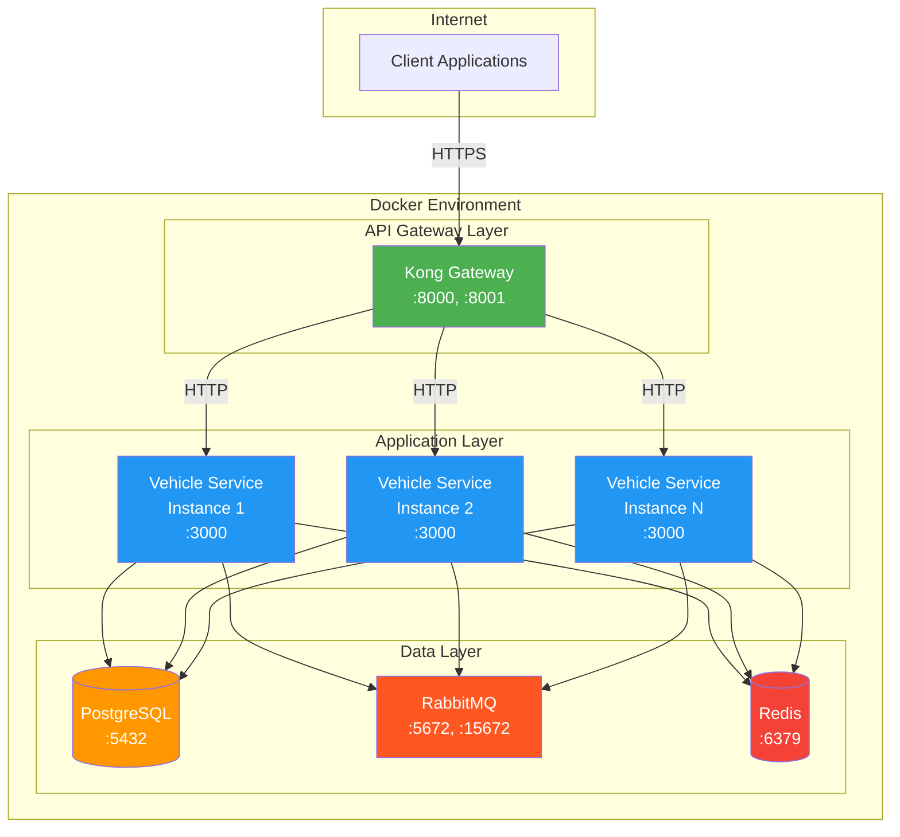
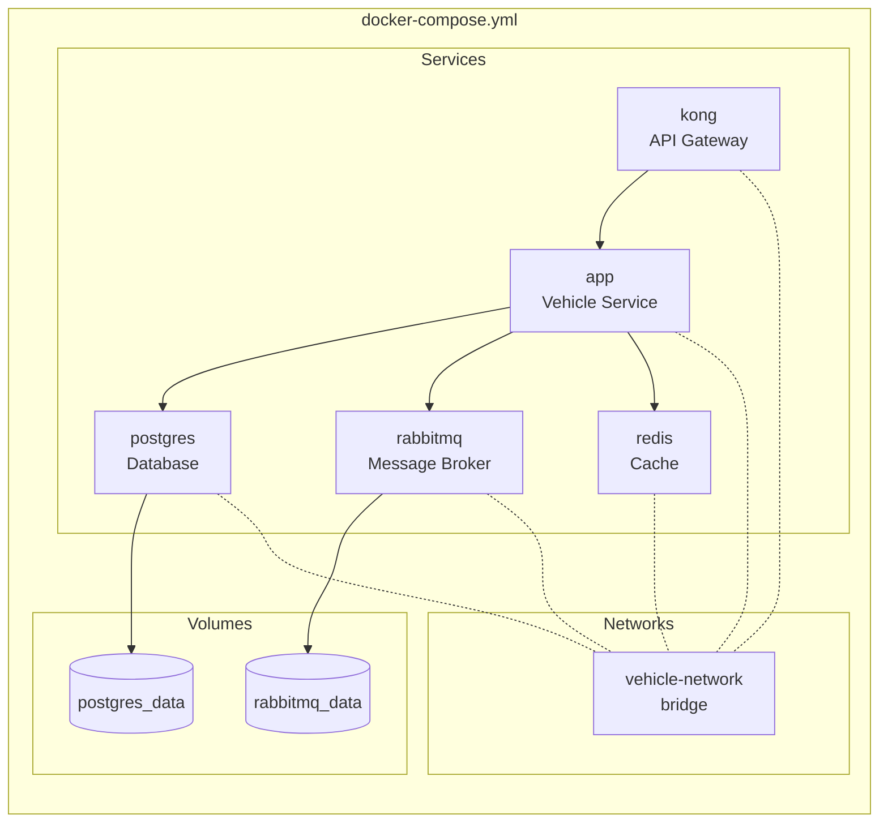
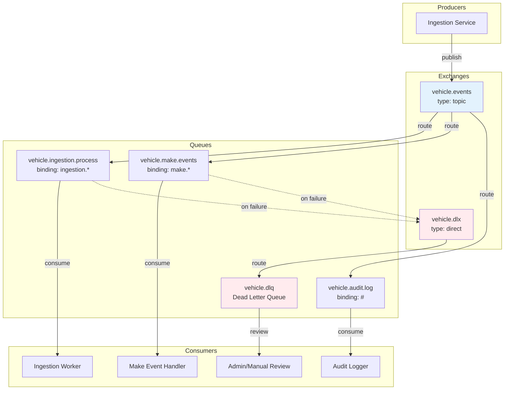
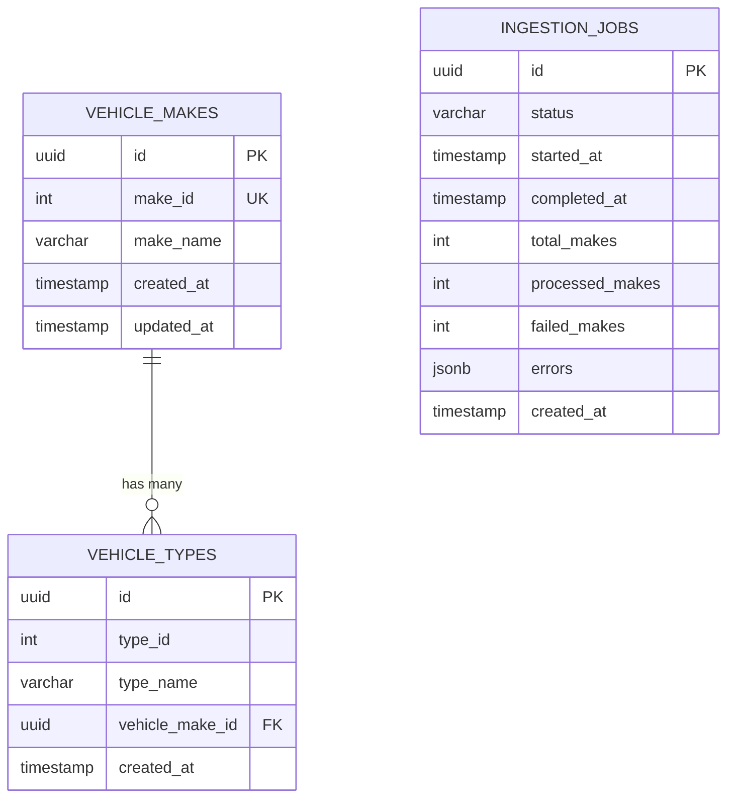
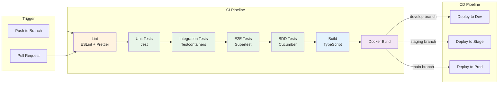
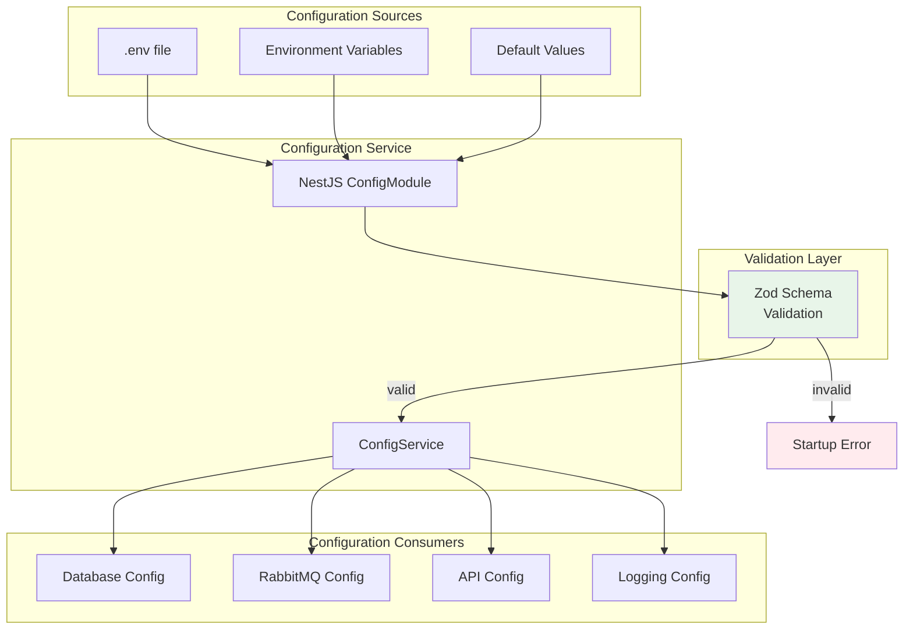
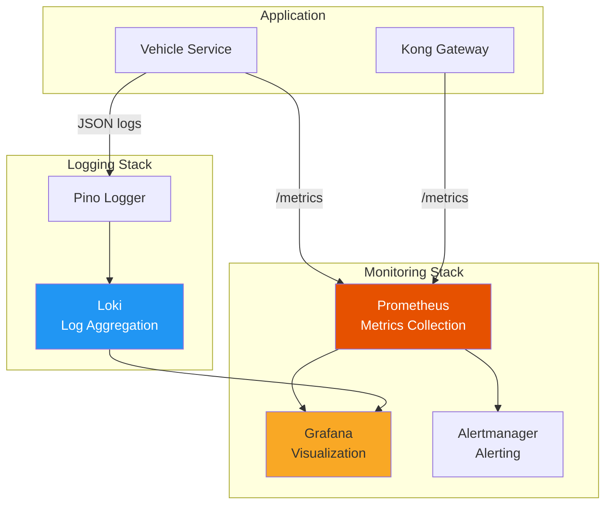

# Infrastructure Diagrams

## 1. Deployment Architecture



## 2. Docker Compose Stack



## 3. RabbitMQ Topology



## 4. Database Schema ERD



## 5. CI/CD Pipeline



## 6. Environment Configuration Flow



## 7. Kong Gateway Routes

```mermaid
flowchart LR
    subgraph External["External Traffic"]
        Client[Client]
    end

    subgraph Kong["Kong Gateway :8000"]
        subgraph Routes["Routes"]
            R1[/graphql]
            R2[/api/v1/*]
            R3[/health/*]
        end

        subgraph Plugins["Global Plugins"]
            RL[rate-limiting]
            CORS[cors]
            Log[file-log]
            Prom[prometheus]
        end
    end

    subgraph Upstream["Vehicle Service :3000"]
        GQL[GraphQL Endpoint]
        REST[REST Endpoints]
        Health[Health Endpoints]
    end

    Client --> R1
    Client --> R2
    Client --> R3

    R1 --> RL
    R2 --> RL
    R3 --> RL
    RL --> CORS
    CORS --> Log
    Log --> Prom

    R1 --> GQL
    R2 --> REST
    R3 --> Health

    style Kong fill:#4caf50,color:white
```

## 8. Monitoring Stack (Optional)


