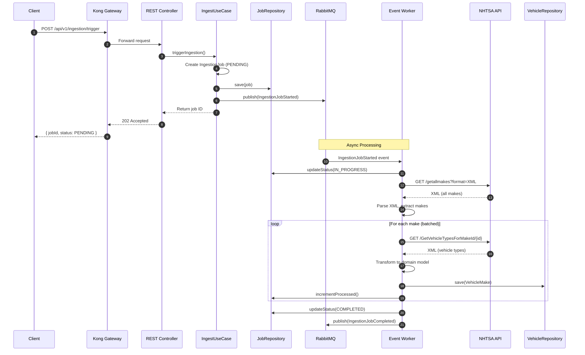
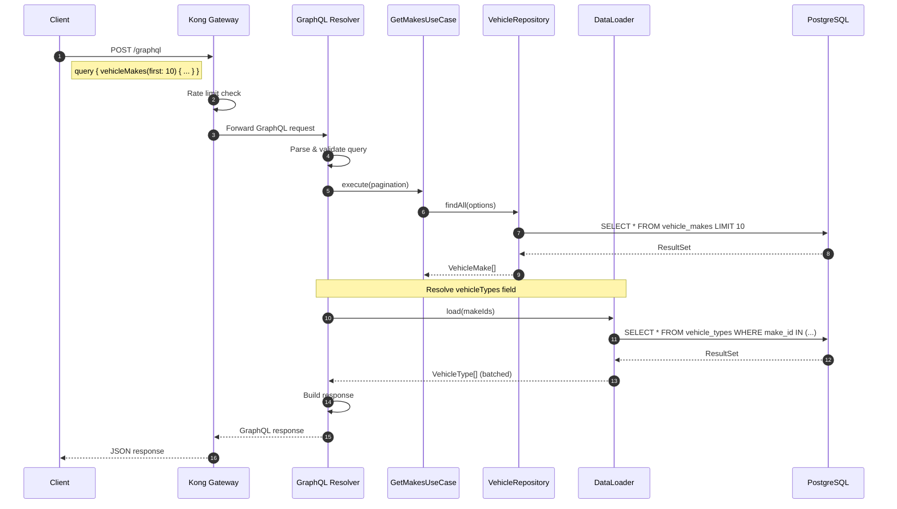
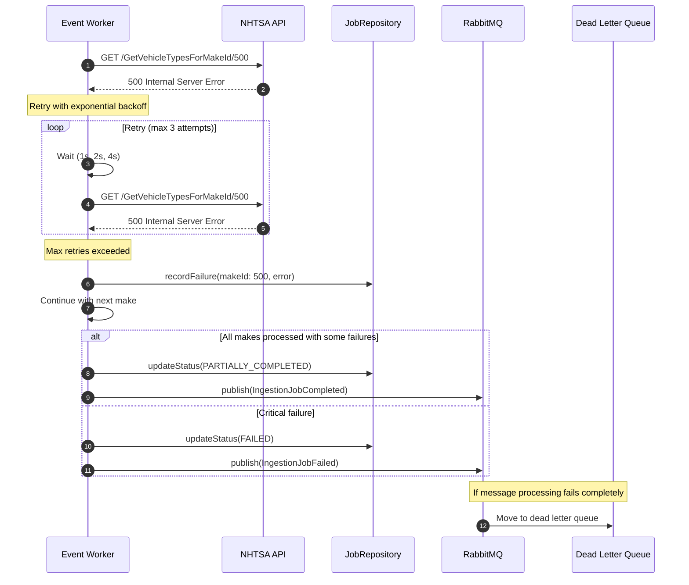
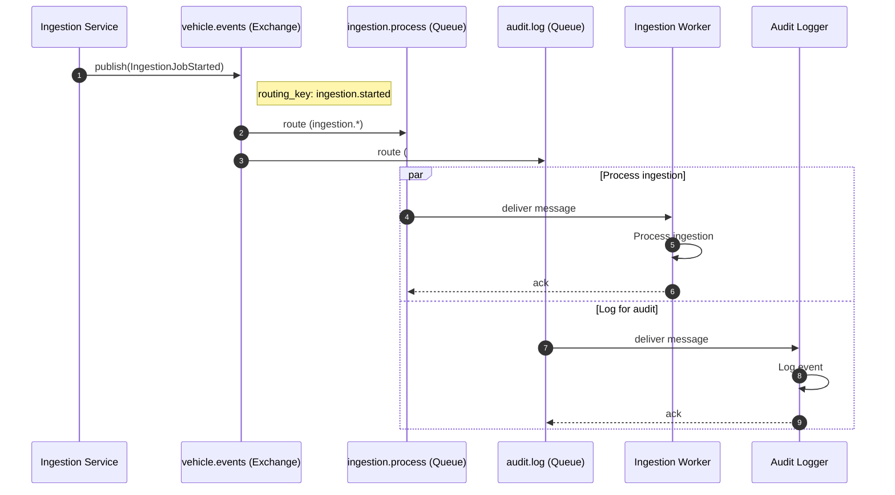
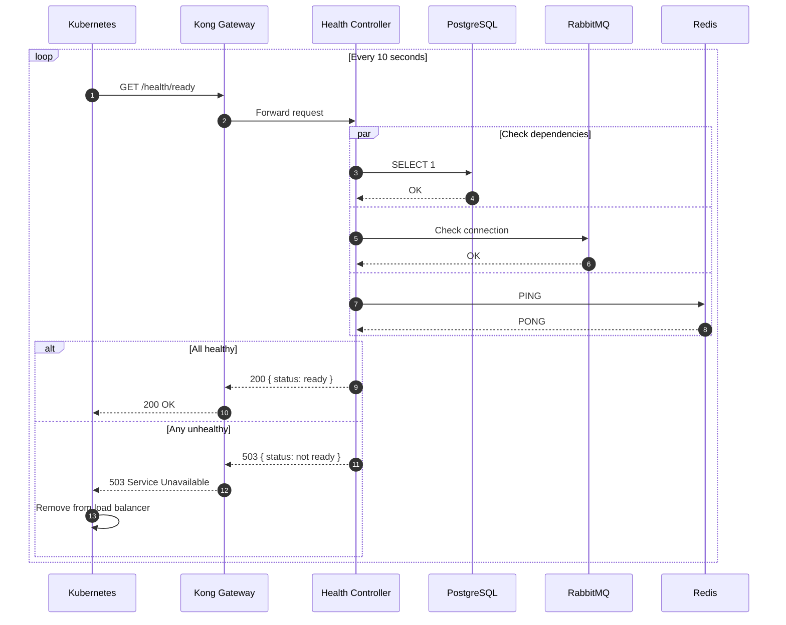

# Sequence Diagrams

## 1. Data Ingestion Flow

```mermaid
sequenceDiagram
    autonumber
    participant Client
    participant Kong as Kong Gateway
    participant REST as REST Controller
    participant UC as IngestUseCase
    participant Repo as JobRepository
    participant RMQ as RabbitMQ
    participant Worker as Event Worker
    participant NHTSA as NHTSA API
    participant VRepo as VehicleRepository

    Client->>Kong: POST /api/v1/ingestion/trigger
    Kong->>REST: Forward request
    REST->>UC: triggerIngestion()
    UC->>UC: Create IngestionJob (PENDING)
    UC->>Repo: save(job)
    UC->>RMQ: publish(IngestionJobStarted)
    UC-->>REST: Return job ID
    REST-->>Kong: 202 Accepted
    Kong-->>Client: { jobId, status: PENDING }

    Note over Worker,RMQ: Async Processing

    RMQ->>Worker: IngestionJobStarted event
    Worker->>Repo: updateStatus(IN_PROGRESS)
    Worker->>NHTSA: GET /getallmakes?format=XML
    NHTSA-->>Worker: XML (all makes)
    Worker->>Worker: Parse XML, extract makes

    loop For each make (batched)
        Worker->>NHTSA: GET /GetVehicleTypesForMakeId/{id}
        NHTSA-->>Worker: XML (vehicle types)
        Worker->>Worker: Transform to domain model
        Worker->>VRepo: save(VehicleMake)
        Worker->>Repo: incrementProcessed()
    end

    Worker->>Repo: updateStatus(COMPLETED)
    Worker->>RMQ: publish(IngestionJobCompleted)
```

## 2. GraphQL Query Flow

```mermaid
sequenceDiagram
    autonumber
    participant Client
    participant Kong as Kong Gateway
    participant GQL as GraphQL Resolver
    participant UC as GetMakesUseCase
    participant Repo as VehicleRepository
    participant DL as DataLoader
    participant DB as PostgreSQL

    Client->>Kong: POST /graphql
    Note right of Client: query { vehicleMakes(first: 10) { ... } }
    Kong->>Kong: Rate limit check
    Kong->>GQL: Forward GraphQL request

    GQL->>GQL: Parse & validate query
    GQL->>UC: execute(pagination)
    UC->>Repo: findAll(options)
    Repo->>DB: SELECT * FROM vehicle_makes LIMIT 10
    DB-->>Repo: ResultSet
    Repo-->>UC: VehicleMake[]

    Note over GQL,DL: Resolve vehicleTypes field

    GQL->>DL: load(makeIds)
    DL->>DB: SELECT * FROM vehicle_types WHERE make_id IN (...)
    DB-->>DL: ResultSet
    DL-->>GQL: VehicleType[] (batched)

    GQL->>GQL: Build response
    GQL-->>Kong: GraphQL response
    Kong-->>Client: JSON response
```

## 3. Error Handling Flow

```mermaid
sequenceDiagram
    autonumber
    participant Worker as Event Worker
    participant NHTSA as NHTSA API
    participant Repo as JobRepository
    participant RMQ as RabbitMQ
    participant DLQ as Dead Letter Queue

    Worker->>NHTSA: GET /GetVehicleTypesForMakeId/500
    NHTSA-->>Worker: 500 Internal Server Error

    Note over Worker: Retry with exponential backoff

    loop Retry (max 3 attempts)
        Worker->>Worker: Wait (1s, 2s, 4s)
        Worker->>NHTSA: GET /GetVehicleTypesForMakeId/500
        NHTSA-->>Worker: 500 Internal Server Error
    end

    Note over Worker: Max retries exceeded

    Worker->>Repo: recordFailure(makeId: 500, error)
    Worker->>Worker: Continue with next make

    alt All makes processed with some failures
        Worker->>Repo: updateStatus(PARTIALLY_COMPLETED)
        Worker->>RMQ: publish(IngestionJobCompleted)
    else Critical failure
        Worker->>Repo: updateStatus(FAILED)
        Worker->>RMQ: publish(IngestionJobFailed)
    end

    Note over RMQ,DLQ: If message processing fails completely
    RMQ->>DLQ: Move to dead letter queue
```

## 4. Event-Driven Communication

```mermaid
sequenceDiagram
    autonumber
    participant Ingestion as Ingestion Service
    participant Exchange as vehicle.events (Exchange)
    participant Q1 as ingestion.process (Queue)
    participant Q2 as audit.log (Queue)
    participant Worker as Ingestion Worker
    participant Audit as Audit Logger

    Ingestion->>Exchange: publish(IngestionJobStarted)
    Note right of Exchange: routing_key: ingestion.started

    Exchange->>Q1: route (ingestion.*)
    Exchange->>Q2: route (#)

    par Process ingestion
        Q1->>Worker: deliver message
        Worker->>Worker: Process ingestion
        Worker-->>Q1: ack
    and Log for audit
        Q2->>Audit: deliver message
        Audit->>Audit: Log event
        Audit-->>Q2: ack
    end
```

## 5. Health Check Flow

```mermaid
sequenceDiagram
    autonumber
    participant K8s as Kubernetes
    participant Kong as Kong Gateway
    participant Health as Health Controller
    participant DB as PostgreSQL
    participant RMQ as RabbitMQ
    participant Redis as Redis

    loop Every 10 seconds
        K8s->>Kong: GET /health/ready
        Kong->>Health: Forward request

        par Check dependencies
            Health->>DB: SELECT 1
            DB-->>Health: OK
        and
            Health->>RMQ: Check connection
            RMQ-->>Health: OK
        and
            Health->>Redis: PING
            Redis-->>Health: PONG
        end

        alt All healthy
            Health-->>Kong: 200 { status: ready }
            Kong-->>K8s: 200 OK
        else Any unhealthy
            Health-->>Kong: 503 { status: not ready }
            Kong-->>K8s: 503 Service Unavailable
            K8s->>K8s: Remove from load balancer
        end
    end
```
