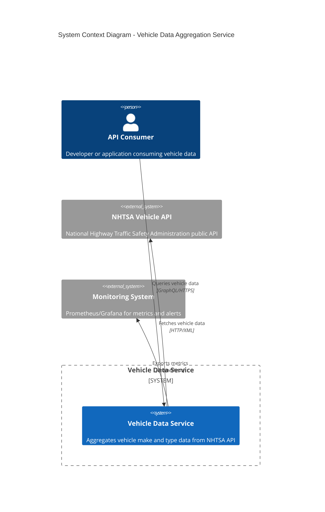

# System Context Diagram

## Description

This diagram shows the system context for the Vehicle Data Aggregation Service:

- **API Consumer**: External clients (web applications, mobile apps, other services) that query vehicle data through the GraphQL API
- **Vehicle Data Service**: The main system that aggregates, transforms, and serves vehicle data
- **NHTSA Vehicle API**: External government API providing vehicle make and type information
- **Monitoring System**: Optional observability stack for metrics and alerting
